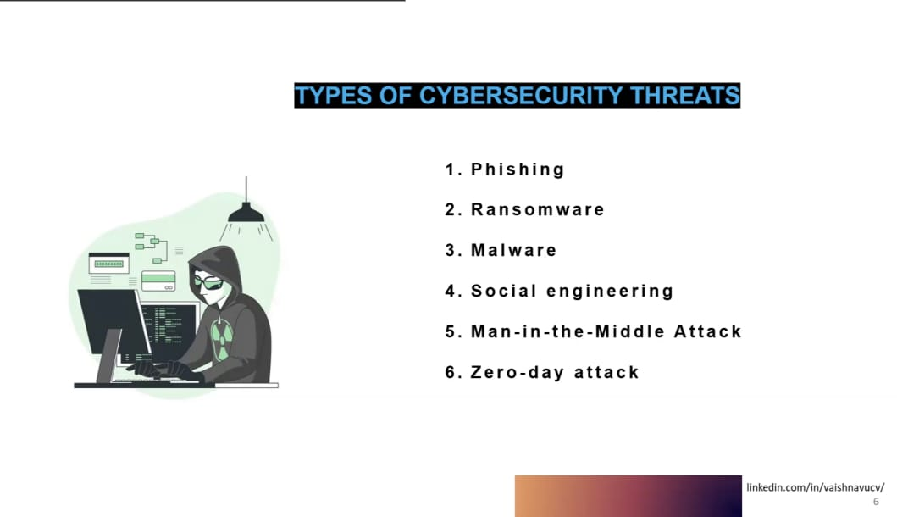

# 🛡️ Day-02: Cybersecurity Report

Welcome to **Day 2** of the Cybersecurity course. Today, we explore various cybersecurity threats, attack methods, Linux distributions for ethical hacking, and setup steps for VirtualBox and VMware tools.

---

## 🔥 Types of Cybersecurity Threats

### 1. **Phishing**
A fraudulent attempt to obtain sensitive information by disguising as a trustworthy entity in communication.

### 2. **Ransomware**
A type of malware that encrypts files and demands ransom to restore access.

### 3. **Malware**
Malicious software that disrupts, damages, or gains unauthorized access to systems.

### 4. **Social Engineering**
Psychological manipulation to trick users into giving up confidential information or access.

### 5. **Man-in-the-Middle Attack**
An attacker intercepts communication between two systems to steal or manipulate data.

### 6. **Zero-Day Attack**
An attack that targets a previously unknown vulnerability in software or hardware.

---

## 🔑 Cryptography

Cryptography protects information by converting it into unreadable code. It's used in secure communications, authentication, and integrity assurance.

---

## 🎭 Social Engineering Tools

### 🖥️ USB Rubber Ducky
A disguised USB device that executes preloaded keystroke attacks once plugged in.

### 🔌 OMG Cable
A malicious cable that acts like a keyboard and can wirelessly inject commands via Wi-Fi.

---

## 📈 Search Engine Optimization (SEO)

**Black Hat SEO** involves manipulating search engine results to drive traffic to malicious sites — often used in phishing campaigns and malware distribution.

---

## 🐧 Popular Hacking Linux Distributions

### 1. **BlackArch Linux**
- Based on Arch Linux.
- 2800+ penetration testing tools.
- Highly customizable and powerful.

### 2. **Parrot Security OS**
- Based on Debian.
- Suited for penetration testing, forensics, and development.

### 3. **Garuda Linux (Geruda)**
- Arch-based.
- Aesthetic UI with performance tweaks.
- BlackArch edition available for cybersecurity.

### 4. **Black Box**
- Lightweight distro.
- Useful for beginners and quick tests.
- Comes pre-installed with essential tools.

---

## 💻 Virtualization Tools

### ✅ How to Download & Install **VirtualBox**

1. Visit [https://www.virtualbox.org/](https://www.virtualbox.org/)
2. Click on **Download VirtualBox**.
3. Select the installer for your operating system.
4. Run the installer and follow setup instructions.
5. After installation, launch VirtualBox.

---

## 🐉 How to Run Kali Linux on **VMware**

1. Download Kali VMware image from [https://www.kali.org/get-kali/](https://www.kali.org/get-kali/)
2. Download VMware Workstation Player from [https://www.vmware.com](https://www.vmware.com)
3. Install and open VMware.
4. Click **Open a Virtual Machine**.
5. Browse to the `.vmx` file from the Kali download.
6. Click **Power on this virtual machine**.

---

> 💬 _"The best defense is a well-informed offense."_  

---

📎 Connect with mentor: [linkedin.com/in/vaishnavucv](https://linkedin.com/in/vaishnavucv)
